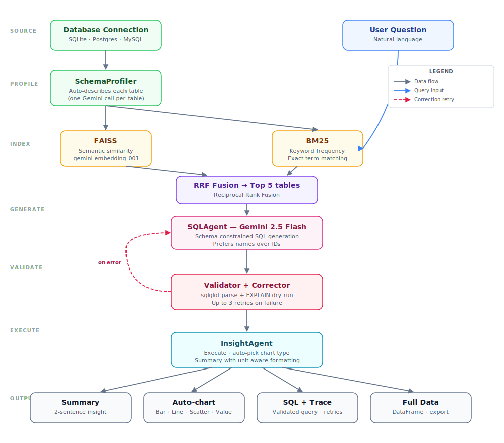

# DataLens

Natural-language analytics over relational databases using hybrid schema
retrieval, constrained SQL generation, validation, correction retries, and
automatic visualizations.

[Live demo](https://vishwas-datalens-chat-with-database.streamlit.app/) |
[Security notes](SECURITY.md)



## What It Demonstrates

- Database schema profiling and document construction at connection time
- Hybrid FAISS and BM25 retrieval with Reciprocal Rank Fusion
- Gemini-based SQL generation grounded in retrieved tables and columns
- A read-only SQL policy enforced with `sqlglot`
- Database-aware validation with `EXPLAIN` before execution
- Error-guided correction for failed generations, with bounded retries
- Result-size limits, heuristic chart selection, and generated summaries
- Offline unit tests, GitHub Actions CI, and a reproducible Chinook benchmark

This is a portfolio project and experimental analytics assistant, not a
production database administration tool.

## Pipeline

| Component | Responsibility |
|---|---|
| `SchemaProfiler` | Inspects tables, columns, and sample rows; generates table descriptions |
| `SchemaRetriever` | Combines semantic and keyword retrieval over schema documents |
| `SQLAgent` | Generates one SQL query using the retrieved schema context |
| `Validator` | Rejects non-read-only or multi-statement SQL, then runs `EXPLAIN` |
| Correction loop | Sends validation feedback back to the SQL agent for up to three attempts |
| `InsightAgent` | Executes validated SQL, caps results, selects a chart, and creates a summary |

## Safety Boundary

DataLens accepts a single read-only query. It rejects DML, DDL, transactions,
administrative commands, and multiple statements. Returned result sets are
capped at 1,000 rows.

Application checks are not a substitute for database permissions. Use a
dedicated read-only account with access limited to approved schemas. Schema
metadata, sampled rows, and some query-result previews are sent to Google
Gemini. Do not use confidential, regulated, personal, or production data in
the public demo.

See [SECURITY.md](SECURITY.md) for the complete data-handling guidance.

## Evaluation

The repository includes 15 natural-language questions over the public Chinook
database. Each generated query is compared with a reference query using:

- first-attempt validation rate
- final validation rate after correction
- execution success rate
- result-match rate
- average correction count
- average generation latency

No benchmark score is claimed in this README until it has been run and the
generated JSON results have been reviewed.

```powershell
$env:GOOGLE_API_KEY="your-key"
python -m scripts.run_benchmark
```

Results are written to `benchmark_results/chinook_results.json` and are ignored
by Git by default.

## Run Locally

Requirements:

- Python 3.11+
- A Gemini API key from [Google AI Studio](https://aistudio.google.com/apikey)

```powershell
git clone https://github.com/VishwasPrabhakara/datalens.git
cd datalens
python -m venv .venv
.\.venv\Scripts\Activate.ps1
python -m pip install -r requirements.txt
Copy-Item .env.example .env
streamlit run app.py
```

Add your API key to `.env`, then open `http://localhost:8501`.

The app supports the bundled Chinook database, uploaded SQLite files, and
SQLAlchemy connection URIs. Non-SQLite databases require the appropriate
Python database driver to be installed separately.

## Tests

The automated tests do not call Gemini. They cover the SQL policy, semantic
validation, correction-loop behavior, query execution, and result-size cap.

```powershell
python -m pip install -r requirements-dev.txt
pytest
```

GitHub Actions runs the same test suite on every push and pull request.
Scripts under `scripts/manual_*.py` are optional Gemini-backed integration
checks.

## Project Layout

```text
datalens/
|-- .github/workflows/tests.yml
|-- benchmarks/chinook_questions.json
|-- scripts/
|   |-- run_benchmark.py
|   `-- manual_*.py
|-- tests/
|   |-- test_insight.py
|   |-- test_loop.py
|   `-- test_validator.py
|-- app.py
|-- datalens.py
|-- schema_profiler.py
|-- retrieval.py
|-- agents.py
|-- validator.py
|-- loop.py
|-- insight.py
|-- prompts.py
|-- chinook.db
|-- architecture.svg
|-- SECURITY.md
`-- requirements.txt
```

## Stack

Python, Streamlit, Gemini, LangChain, FAISS, BM25, SQLAlchemy, sqlglot,
pandas, Plotly, and pytest.

## Author

Built by [Vishwas Prabhakara](https://github.com/VishwasPrabhakara), Project
Assistant (AIML) at the Indian Institute of Science.

## License

[MIT](LICENSE)
